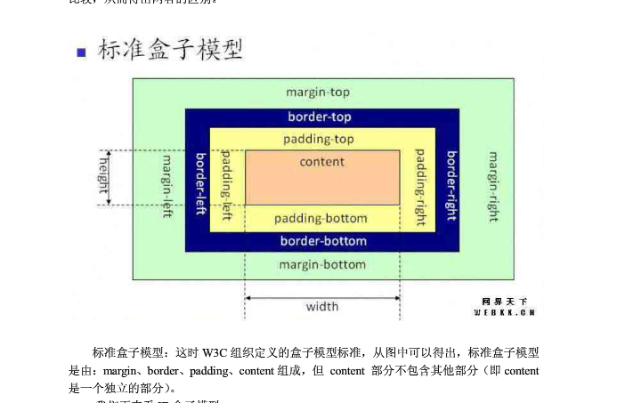
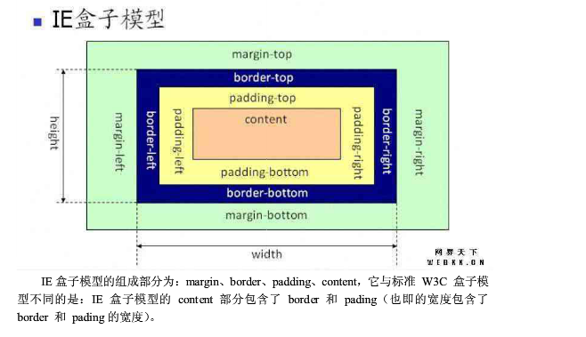
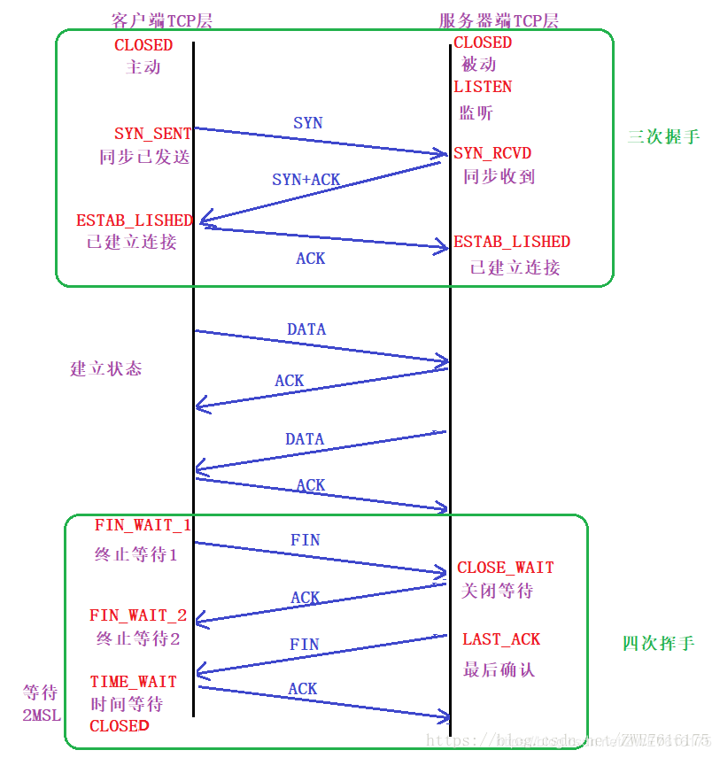

### <center>错题记录</center> ###
>1. javascript语言特性中，有很多方面和我们接触的其他编程语言把不太一样，比如说，javascript语言实现继承机制的核心是<strong>prototype</strong>,而不是java语言那样的类式继承。javascript解析引擎在读取一个Object的属性的值时，会沿着<strong>原型链</strong>向上寻找，如果最终没有找到，则该属性值为<strong>undefined</strong>  
>2. 请填写内容让下面代码支持a.name="name1";b.name="name2";
>   ``` javascript 
>   function obj(name){
>       if(name){this.name = name;}return this;
>   }
>   obj.prototype.name = "name2";
>   var a = obj("name1");
>   var b = new obj;
>   ```
>3. 实现如下布局。核心区域左侧自适应，右侧固定宽度200  
>   <a href="./3.html" target="_blank">参考代码</a>  
>4. 下列哪个操作是w3c标准定义的阻止事件向父容器传递: 
>   * e.preventDefault() DOM中的事件对象 取消事件默认行为
>   * e.cancelBubble=true IE中的事件对象 取消事件冒泡
>   * e.stopPropagation() DOM中的事件对象 取消事件冒泡对当前节点无影响
>   * e.stopImmediatePropagation() DOM中的事件对象 取消事件冒泡同时阻止当前节点上的事件处理程序被调用
>   * e.returnValue() IE中的事件对象 取消时间默认行为  
>5. 盒子模型  
>   >* 标准盒子模型  
>              
>   >* IE盒子模型  
>             
>6. 关于HTML语义化，一下 哪个说法是正确的？D 
>   >A. 语义化的html有利于机器的阅读，如PDA手持设备、搜索引擎爬虫；但不利于人的阅读  
>   >B. Table属于过时的标签，遇到数据列表时，需尽量使用div来模拟表格  
>   >C. 语义化是HTML5带来的新概念，此前版本的HTML无法做到语义化  
>   >D. header、article、address都属于语义化明确的标签  
>   ><a href="https://www.cnblogs.com/freeyiyi1993/p/3615179.html" target="_blank">语义的相关介绍</a>    
>7. 关于HTTP协议，下面哪个说法是正确的？C  
>   >A. HTTP协议是有状态协议
>   >B. 以下是一个Http链接的response的响应头:GET /xxx/xxx/js/lib/test.js HTTP/1.1 Host: 127.0.0.1 Connection: keep-alive Pragma: no-cache Cache-Control: no-cache Accept: */*  
>   >C. RESTful接口中，利用HTTP协议的method字段来描述要对资源操作的方式，比如GET表示获取资源，POST表示新增一个资源，PUT表示更新资源，DELETE表示删除资源等等。  
>   >D. 一个HTTP请求返回的HTTP状态码中，304表示临时重定向。         
>8. 使用for in 循环数组中的元素会枚举原型链上的所有属性，过滤这些属性的方式是使用<strong>hasOwnProperty()</strong>函数  
>   for in 可以获取object的所有属性，包括自定义属性以及原型链属性，hasOwnPropery()只能获取自定义属性，无法获取原型链属性。  
>9. 删除给定数组中的第二项和第三项，并且在得到的新的数组中第一项后面添加一个新的值
>   ```javascript 
>   var arr1 = ['a','b','c','d','e'];
>   var arr2 = arr1.splice(1,2,'newvalue');
>   ```  
>10. 写一个求和的函数sum，达到下面的效果
>   ``` javascript 
>       // Should equal 15
>       sum(1, 2, 3, 4, 5);
>       // Should equal 0
>       sum(5, null, -5);
>       // Should equal 10
>       sum('1.0', false, 1, true, 1, 'A', 1, 'B', 1, 'C', 1, 'D', 1,
>         'E', 1, 'F', 1, 'G', 1);
>       // Should equal 0.3, not 0.30000000000000004
>       sum(0.1, 0.2);  
>   ```
>   <a href="./9.html" target="_blank">参考代码</a>  
>11. 写一个traverse函数，输出页面所有高度和宽度大于50像素的节点。  
>   ``` javascript 
>   function traverse(){
>       return Array.prototype.filter.call(document.querySelectorAll('body *',function(node){return node.offsetWidth>50&&node.offsetHeight>50;}))
>   }
>   ```
>12. 正则表达式/a+(bab)?(caac)*/,下列选项中是该正则表达式的子集是?C  
>   >A. /(bab)(caca)?/  
>   >B. /a(bab){2}(caac)*/  
>   >C. /a{2}/  
>   >D. /a+(bab){0,1}(ca)+(ca)/  
>   >E. /a(^bab)+(caac){1,}/  
>   >F. /a+(babc){2,}(acc){1,}/  
>13. 下列说法错误的是:C
>   >A. 在Blink和WebKit的浏览器中，某个元素具有3D或透视变换(perspective transgform)的CSS属性，会让浏览器创建单独的图层。   
>   >B. 我们平常会使用left和top属性来修改元素的位置，但left和top会触发重新布局，取而代之的更好方法是使用translate，这个不会出发重新布局。  
>   >C. 移动端要想动画性能流畅，应该使用3D硬件加速，因此最好给页面中的元素尽量添加translate3d或者translateZ(0)来触发3D硬件加速。  
>   >D. 解决浏览器渲染的性能问题时，首要目标就是要避免层的重绘和重排。  
>   ><a href="https://segmentfault.com/a/1190000000490328" target="_blank">参考资料</a>
>14. 将数组var a=[1,2,3]变成数字[4,3,2,1]下面的方式正确的是？A、C  
>   >A. a.reverse().unshift(4)  
>   >B. a.push(4).reverse()  
>   >C. a.push(4);a.reverse()  
>   >D. a.splice(3,1,4).reverse()  
>   ><a href="https://www.nowcoder.com/profile/100839276/test/26732592/50527#summary">数组方法的总结</a>
>15. 目前HTTP2协议已经逐渐普及到日常服务器中，以下对于HTTP2协议描述正确的是:  
>   >A. 所有http请求都建立在一个TCP请求上，实现多路复用。  
>   >B. 可以给请求添加优先级  
>   >C. 服务器主动推送 server push  
>   >D. HTTP2的头部会减少，从而减少流量传输  
>   ><a href="https://blog.csdn.net/zqjflash/article/details/50179235">HTTP2协议详解</a>  
>16. 以下代码，分别给节点#box增加如下样式，问节点#box距离body的上边距是多少？
>   ``` html 
>   <body style="margin:0;padding:0">
>       <div id="box" style="top:10px;margin：20px 10px">
>       </div>
>   </body>
>   ```
>   如果设置position:static;则上边距为20px  
>   如果设置position:relative;则上边距是30px
>   如果设置position:absolute;则上边距是30px  
>   如果设置position:sticky;则滚动起来上边距为10px  
>17. 我们需要实现动态加载一个javascript资源，但是有几处不知道如何处理，需要您的帮助完成这一项工作  
>   ``` javascript 
>   var script = document.createElement("script");
>   var head = document.getElementsByTagName("head")[0];
>   script.type = "text/javascript";
>   script.src = "//i.alicdn.com/resource.js";
>   
>   //绑定资源加载事件
>   script.onreadystatechange = function(){
>       //判断资源加载状态是否为加载成功或加载完成
>       if(/^(loaded|complete)$/).test(script.readyState)){
>           script.onreadystatechange = null;
>       }
>   }
>   //绑定资源加载失败事件
>   script.onError = function(){
>   }
>   head.insertBefore(script,head.firstChild)
>   ```
>18. 请问何为混合应用(Hybrid APP),与原生Native应用相比它的优劣势。  
>   Hybrid APP是Native APP上结合使用了Web View(Native APP的模块或称组件，用来加载Web资源)，采用了Web技术的APP，本质上属于原生应用(APP外壳)
>   优点: 
>   >1. 兼容性良好，"一次开发，多处运行",能够减少原生APP开发在多平台带来的问题  
>   >2. 代码移植性高  
>   >3. APP更加轻便，内容更新方便，部分更新不用从APP Store下载
>   劣势:  
>   >1. 性能:相对不如Native APP性能良好、体验流畅  
>   >2. Web技术在APP中操作权限有限，需要APP同步支持  
>19. jquery ajax中都支持哪些数据类型?A,B,C,D  
>   >A. xml  
>   >B. html  
>   >C. jsonp  
>   >D. json  
>   >   通过dataType选项还可以指定其他不同数据处理方式。除了单纯的XML，还可以指定 html、json、jsonp、script或者text。  
>20. 下面哪些语句可以在js里判断一个对象oStringObject是否为String。 A  
>   >A. oStringObject instanceof String  
>   >B. typeof oStringObject == 'string'  
>   >C. oStringObject is String  
>   >D. 以上答案都不正确  
>21. 常见的浏览器端的存储技术有哪些?A,B,D  
>   >A. cookie  
>   >B. localStorage  
>   >C. session  
>   >D. userData  
>       userData:IE浏览器可以使用userData来存储数据，容量可达640K。  
>22. 下面有关html结构描述正确的有？A,B,D 
>   >A. \<ul\>\<li\>\</li\>\</ul\>\</pre\>  
>   >B. \<ol\> \<li\> \</li\> \</ol\>  
>   >C. \<dl\>\<dt\>\<dd\>\</dd\>\</dt\>\</dl\>  
>   >D. \<table\> \<tr\> \<td\>\</td\> \</tr\> </table> 
>   >   C正确的应该是\<dl\>\<dt\>\</dt\>\<dd\>\</dd\>\</dl\>  
>23. 以下是行内元素的有?A,B  
>   >A. span  
>   >B. input  
>   >C. ul  
>   >d. p  
>   <a href="https://www.nowcoder.com/profile/100839276/test/26791280/15838#summary">行内元素和块级元素参考</a>  
>24. 下面有关javascript内部对象的描述，正确的有?A,B,C,D  
>   >A. History对象包含用户(在浏览器窗口中)访问过的URL  
>   >B. Location对象包含有关当前URL的信息  
>   >C. Window对象表示浏览器中打开的窗口  
>   >D. Navigator对象包含有关浏览器的信息  
>25. 假设当前屏幕分辨率为1024*768，定义一个居中的占屏幕一半大小的表格语句是?A,B,C,D  
>   >A. \<TABLE ALIGN="CENTER" WIDTH="50%"\>\</TABLE\>  
>   >B. \<TABLE ALIGN="CENTER" WIDTH="512"\>\</TABLE\>  
>   >C. \<DIV\><TABLE WIDTH="512"\>\</TABLE\>\</DIV\>  
>   >D. \<CENTER\>\<TABLE WIDTH="50%"\>\</TABLE\>\</CENTER\>  
>26. 下面属于CSS3新增属性的有?A,B,C,D  
>   >A. box-shadow  
>   >B. text-shadow  
>   >C. border-radius  
>   >D. rgba  
>   <a href="https://www.nowcoder.com/profile/100839276/test/26791280/14877#summary">CSS3新增的属性</a>  
>27. 请给Array本地对象添加一个原型方法,它用于删除数组条目中重复的条目(可能有多个),返回值是一个包含被删除的重复条目的新数组。  
>   >```javascript 
>   >Array.prototype.distinct = function(){
>   >   var ret = [];
>   >   for(var i=0;i < this.length;i++){
>   >       for(var j=i+1;j<this.length){
>   >           if(this[i] === this[j]){
>   >               ret.push(this.splice(j,1)[0]);
>   >           }else{
>   >               j++;
>   >           }
>   >       }
>   >   }
>   >   return ret;
>   >}
>   >```  
>28. 请填充代码，使mySort()能使传入的参数按照从小到大的顺序显示出来。  
>   >``` javascript 
>   >function mySort() {
>   >   var tags = new Array();
>   >   tags = Array.prototype.slice.call(arguments)
>   >   tags.sort(function(pre,next){
>   >       return pre - next;
>   >   })
>   >   return tags;
>   >}
>   >var result  = mySort(50,11,16,32,24,99,57,100);
>   >console.info(result);
>   >```  
>29. 下面标签嵌套正确的是?D  
>   >A. \<ul\>\<p\>牛客网\</p\>\</ul\>  
>   >B. \<a href="#"\>\<a href="#"\>牛客网\</a\>\</a\>  
>   >C. \<dl\>\<li\>牛客网\</li>\</dl\>  
>   >D. \<ol\>\<li\>牛客网\</li\>\</ol\>  
>   >   ul只能紧挨着li、a中不能再嵌套a、dl dt dd、ol li是有序排序  
>30. 下面哪些是HTML5新增的表单元素？A,C  
>   >A. datalist  
>   >B. optgroup  
>   >C. output  
>   >D. legend  
>   >   HTML5的新的表单元素:datalist、keygen、output  
>   >   datalist规定输入域的选项列表，通过option创建！keygen提供  一种验证用户的可靠方法，密钥对生成器，私钥存于客户端，公钥发到服务器，用于之后验证客户端证书！output元素用于不同类型的输出！  
>31. 在HTML中，()可以在网页上通过链接直接打开邮件客户端发送邮件。C  
>   >A. \<a href="telnet:ming.zhou@nowcoder.com"\>发送邮件\</a\>  
>   >B. \<a href="mail:ming.zhou@nowcoder.com"\>发送邮件\</a\>  
>   >C. \<a href="mailto:ming.zhou@nowcoder.com"\>发送邮件\</a\>  
>   >D. \<a href="ftp:ming.zhou@nowcoder.com"\>发送邮件\</a\>  
>32. 请选出所有的置换元素()A,B,C,D  
>   >A. img  
>   >B. input  
>   >C. textarea  
>   >D. select  
>   <a href="https://www.jianshu.com/p/d99428ca8065" target="_blank">置换元素与非置换元素</a>  
>33. 下面那条声明能固定背景图片()B  
>   >A. background-attachment:fixed;  
>   >B. background-attachment:scroll;  
>   >C. background-origin: initial;  
>   >D. background-clip:initial;  
>   >   background-attachment有三个值，scroll是默认值，背景图像会随着页面其余部分的滚动而移动。  
>   >   fixed当页面的其余部分滚动时，背景图像不会移动。  
>   >   inherit规定应该从父元素继承 background-attachment属性的设置。  
>   >   background-origin属性规定background-position属性相对于什么位置来定位。  
>   >   background-clip属性规定背景的绘制区域。  
>34. 下面哪个属性不会让div脱离文档流(normal flow)?C  
>   >A. position:absolute;  
>   >B. position:fixed;  
>   >C. position:relative;  
>   >D. float:left;  
>   >   absolute：生成绝对定位的元素，相对于static定位以外的第一个父元素进行定位。  
>   >   fixed:生成绝对定位的元素，相对于浏览器窗口进行定位;相对于浏览器了，也和正常顺序排下来没什么关系了。  
>   >   relative:生成相对定位的元素，相对于其正常位置进行定位。  
>   >   float:left：浮动，使用float脱离文档流时，其他盒子会无视这个元素，但盒子内的文本依然会为这个元素让出位置环绕在周围。  
>35. 假设在今日头条里面，有很多工作人员检查新闻是不是属于虚假新闻，所有新闻真实率达到了98%，工作人员在检验一个真实的新闻把它检验为一个虚假的新闻的概率为2%,而一个虚假的新闻被检验为真实的新闻的概率为5%。那么，一个被检验为真实的新闻确实是真实的新闻的概率是多大?
>   >A. 0.9991  
>   >B. 0.9989  
>   >C. 0.9855  
>   >D. 0.96  
>   >   新闻为真实事件P:P(P)=0.98、新闻为虚假事件N:P(N)=1-P(P)=0.02  
>   >   新闻检验为真事件T、新闻检验为假事件F  
>   >   且P(F|P)=0.02,P(T|N)=0.05。  
>   >   则P(T|P)=0.98,P(F|N)=0.95。  
>   >   而P(P|T)=P(PT)/P(T)=P(P)P(T|P)/(P(PT)+P(NT))=P(P)P(T|P)/(P(P)P(T|P)+P(N)P(N|T))=0.99896  
>36. 以下描述正确的:B,C,D  
>   >A. Http协议所使用的传输层协议是UDP  
>   >B. Https的端口号是443  
>   >C. TCP注重数据可靠性，UDP注重数据传输快  
>   >D. 传输层提供端到端的可靠报文传递和错误恢复  
>   ><a href="https://www.nowcoder.com/profile/100839276/test/26976332/44719#summary" target="_blank">参考资料</a>  
>37. 下列关于操作系统进程与线程的区别正确的是:A,D  
>   >A. 进程是资源分配的基本单位  
>   >B. 线程是资源分配的基本单位  
>   >C. 进程是资源调度的基本单位  
>   >D. 线程是资源调度的基本单位  
>38. 下面那个页面调度算法，当进程分配到的页面数增加时，缺页中断的次数可能增加也可能减少。  
>   >A. FIFO算法  
>   >B. LRU算法  
>   >C. Clock算法  
>   >D. LFU算法  
>   >   FIFO算法会产生当所分配的物理块数增大而缺页数不减反增的异常现象，而LRU和OPT算法永远不会出现Belady异常。  
>   >   <a href="https://blog.csdn.net/wanghao109/article/details/13003479" target="_blank">内存调度参考</a>  
>39. 下列排序算法不稳定的有？  
>   >A. 插入排序  
>   >B. 希尔排序  
>   >C. 冒泡排序  
>   >D. 堆排序  
>   >E. 归并排序  
>   >F. 快速排序  
>   >G. 选择排序  
>   >不稳定:快选堆希  
>   >稳定:插冒归基  
>40. 根据下面代码  
>   > ``` javascript  
>   >   (function(){
>   >       var a=b=5;
>   >   })();
>   >   console.log(b);
>   >   console.log(a);
>   >```  
>   >上面输出的结果:5,Uncaught ReferenceError: a is not defined  
>   >var a=b=5会被解释为var a; b=5；  
>41. 页面有一个按钮button id为button1，通过原生的js如何禁用？  
>   >A. document.getElementById("button1").readOnly = true;  
>   >B. document.getElementById("button1").setAttribute("readyOnly","true");
>   >C. document.getElementById("button1").disabled = true  
>   >D. document.getElementById("button1").setAttribute("disable",true)  
>   >D选项的第二个参数无论什么值都会生效，移除效果使用removeAttribute方法。    
>42. 变量a是一个64位有符号的整数，初始值用16进制表示为:0Xf000000000000000;变量b是一个64为有符号的整数，初始值用16进制表示为:0x7FFFFFFFFFFFFFFF。则a-b的结果用10进制表示为多少()C  
>   >A. 1  
>   >B. -(2^62+2^61+2^60+1)  
>   >C. 2^62+2^61+2^60+1  
>   >D. 2^59+(2^55+2^54+...+2^2+2^1+2^0)  
>   >原码:符号位加上真值的绝对值，即用第一位表示符号位，其余位表示值  
>   >反码:正数的反码是其本身。负数的反码是在原码的基础上，符号位不变，其余按位取反。  
>   >补码:正数的补码是其本身。负数的补码是在原码的基础上，符号位不变，其余按位取反，最后加1。  
>   >a的补码为0xF000000000000000，b的补码为0x7fffffffffffffff。
>   >-b的补码为0x8000000000000001  
>   >而[a-b]补 = [a]补 + [-b]补 = 0x17000000000000001(高位溢出)=0x7000000000000001。  
>43. 关于跨域问题下面说法正确的是?B  
>   >A. 可以利用flash的http请求，来处理跨域问题。  
>   >B. 通过iframe设置document.domain可以实现跨域。  
>   >C. 一般情况下，m.toutiao.com可以ajax请求www.toutiao.com域名下的接口并获得响应。  
>   >D. 通过jsonp方式可以发出post请求其他域名下的接口。  
>   >javascript中实现跨域的方式总结  
>   >   * jsonp请求;原理是利用script标签的跨域特性，可以不受限制地从其他域中加载资源，类似的标签还有img。  
>   >   * document.domain;这种方式用在主域名相同子域名不同的跨域中。  
>   >   * window.name;window的name属性有个特征:在一个窗口的生命周期内，窗口载入的所有页面都是共享一个window.name的，每个页面对window.name都有读写的权限，window.name是持久存在一个窗口载入过的所有页面中的，并不会因为新页面的载入而进行重置。  
>   >   * window.postMessage;window.postMessage是html5中实现跨域访问的一种新方式。可以使用它来向其他的window对象发送消息，无论这个window对象是属于同源或不同源。  
>   >   * CORS;CORS背后的基本思想，就是使用自定义的HTTP头部让浏览器与服务器进行沟通，从而决定请求或响应是应该成功还是应该失败。  
>   >   * Web Sockets;web sockets原理:在JS创建了web socket之后，会有一个HTTP请求发送到浏览器以发起连接，取得服务器响应后，建立的连接会使用HTTP升级从HTTP协议交换为web socket协议。  
>44. 可继承的样式属性包括()?A,C  
>   >A. color  
>   >B. background-color  
>   >C. font-size  
>   >D. border  
>   >E. margin  
>45. 下面哪些属于javascript的typeof运算符的可能结果:()A,C,F,G  
>   >A. symbol  
>   >B. NaN  
>   >C. boolean  
>   >D. null  
>   >E. array  
>   >F. undefined  
>   >G. string  
>   >typeof Symbol()//"symbol"  
>   >typeof Number()//"number"  
>   >typeof String()//"string"  
>   >typeof Function()//"function"  
>   >typeof Object()//"object"  
>   >typeof Boolean()//"boolean"  
>   >typeof null//"object"  
>   >typeof undefined//"undefined"  
>46. TCP断开连接的四次挥手中，第四次挥手发送的包会包含的标记，最正确的描述是？()C  
>   >A. FIN  
>   >B. FIN,PSH  
>   >C. ACK  
>   >D. FIN,ACK  
>     
>47. 关于下列CSS选择器:ID选择器、类选择器、伪类选择器、标签名选择器，排序正确的是()D  
>   >A. ID选择器>Class选择器>伪类=标签名称选择器  
>   >B. ID选择器>伪类>Class选择器>标签名称选择器  
>   >C. ID选择器>Class选择器>伪类>标签名称选择器  
>   >D. ID选择器>Class选择器=伪类>标签名称选择器  
>   >一般来说，选择器的优先级(从上往下依次降低)是:  
>   >   1. 在属性后面使用！important会覆盖页面内任何位置定义的元素样式。  
>   >   2. 作为style属性写在元素内的样式  
>   >   3. id选择器  
>   >   4. 类选择器==伪类  
>   >   5. 标签选择器  
>   >   6. 通配符选择器    
>48. 使用HTML+CSS实现如图布局，border-width:5px，格子大小是50px*50px，hover时
边框变成红色，需要考虑语义化。  
>   >   <a href="./48.html"></a>  
>49. 给出一个上传文件时不用刷新页面的方案，要求写出关键部分的js代码。  
>   > <a href="./49.html"></a>
