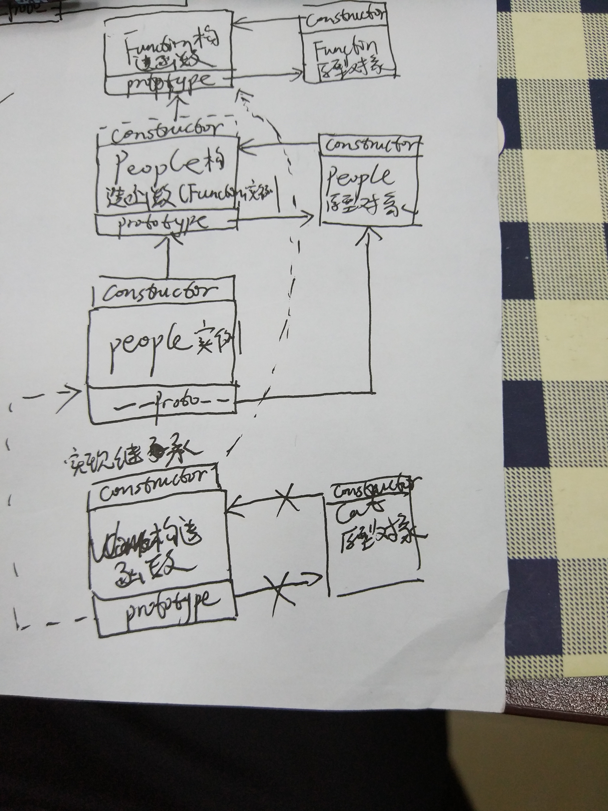

### <center>面试记录</center> ###  
>1. 海康威视面试  
>   9.20日早上10：50。  
>   >---
>   >* 原型，构造函数，实例间的关系  
>   >   >每创建一个函数，该函数都会自动带有一个prototy属性。该属性是一个指针，指向一个对象，该对象称之为原型对象。  
>   >   原型对象上默认有一个属性constructor，该属性也是一个指针，指向其相关联的构造函数。  
>   >   >通过调用构造函数产生的实例对象，都拥有一个内部属性，指向了原型对象。其实例对象能够访问原型对象上的所有属性和方法。  
>   >* 原型链  
>   >   >所有实例都有一个内部指针指向他的原型对象，并且可以访问到原型对象上的所有属性和方法。person对象指向了People的原型对象，可以访问People原型对象上的所有属性和方法。如果People原型对象变成了某一个类的实例dog,这个实例又会指向一个新的原型对象DOG,那么person此时能访问dog的实例属性和DOG原型对象上的所有属性和方法了。同理新的原型对象DOG碰巧又是另外一个对象的实例cat,这个对象实例指向原型对象CAT，那么person就能访问cat的实例属性和CAT原型上的属性和方法了。这样就构成了原型链。  
>   >   >总的来说这样People就继承了Dog，Dog就继承了Cat。People就能继承Dog和Cat的所有属性和方法，Dog继承了Cat的所有属性和方法。  
>   >   >  
>   >---  
>   >* canvas移动绘制的矩形。  
>   >---  
>   >* ES6的新特性，async/await的使用  
>   >   >* Promise
>   >   >* async/await  
>   >   >   async 是ES7才有的与异步操作相关的关键字  
>   >   >   函数返回一个Promise对象，可以使用then方法添加回调函数。  
>   >   >   async函数中可能会有await表达式，async函数执行时，如果遇到await就会先暂停执行，等到触发异步操作完成后，恢复async函数的执行并返回解析值。
>   >   >   ``` javascript  
>   >   >   async function testAsync(){
>   >   >       return "test";
>   >   >   }
>   >   >   testAsync()//返回一个Promise对象
>   >   >   testAsync().then(function(value){
>   >   >       console.log(value);
>   >   >   });//输出test
>   >   >   ```
>   >   >   await操作符用于等待一个Promise对象，它只能在异步函数async function内部使用  
>   >   >   ``` javascript  
>   >   >   async function testAsync(){
>   >   >       var res1 = await "0s";//非Promise对象，直接返回对应的值
>   >   >       console.log(res1);
>   >   >       var res = await new Promise(resolve=>{
>   >   >           setTimeout(function(){
>   >   >               resolve("1s");
>   >   >           },1000);
>   >   >       });//Promise对象，await会暂停执行，等待Promise对象resolve，然后恢复执行
>   >   >       console.log(res);
>   >   >   }  
>   >   >   ```
>   >---  
>   >* 大文件的传输  
>   >* BFC  
>   >* 防抖与节流  
>   >* 浅拷贝与深拷贝  
>   >* 数组去重、扁平、最值  
>   >* 数组乱序-洗牌算法  
>   >* 函数柯里化  
>2. 数字政通   
>   9.25日14：00  
>   >* A、B页面通信  
>   >   * URL,将参数值附在url后面传递到其他页面。  
>   >   ``` javascript  
>   >       //A页面
>   >       window.open('pageB.html?name=guo&code=1');
>   >       window.location.href = "pageB.html?name=guo&code=1"
>   >       //B页面
>   >       window.location.search  
>   >       //中包含A页面传递的数据并且需要使用decodeURI进行编码
>   >   ```
>   >   * H5 web storage，如localStorage和sessionStorage。  
>   >   ``` javascript  
>   >   //A页面
>   >   localStorage.setItem('obj',JSON.stringify({name:'guo',code:1}))  
>   >   //B页面  
>   >   JSON.parse(localStorage.getItem('obj'))
>   >   * Cookie，使用浏览器Cookie传递参数。  
>   >       document.cookie = "";
>   >       document.cookie.split(";")//分割cookie并解析获取
>   >* CSS布局平分三列，flex布局  
>   >* 响应式布局，不同设备配适  
>   >* A、B按钮异步控制同一个数据  
>    